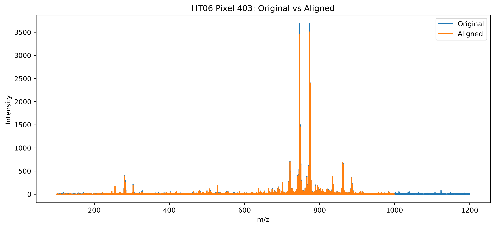
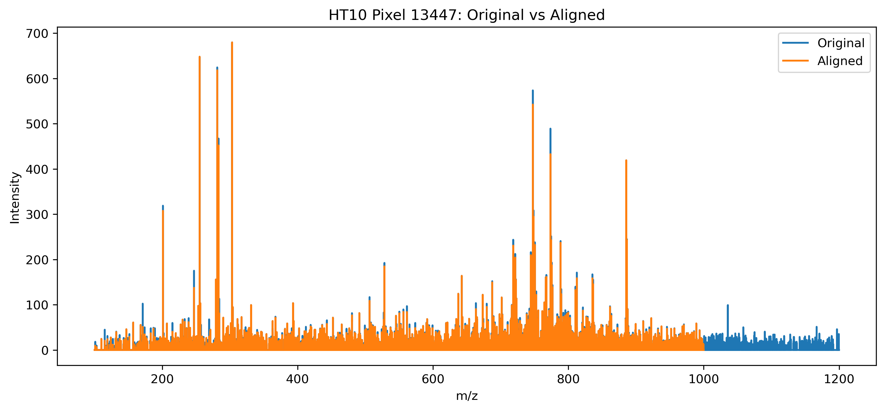
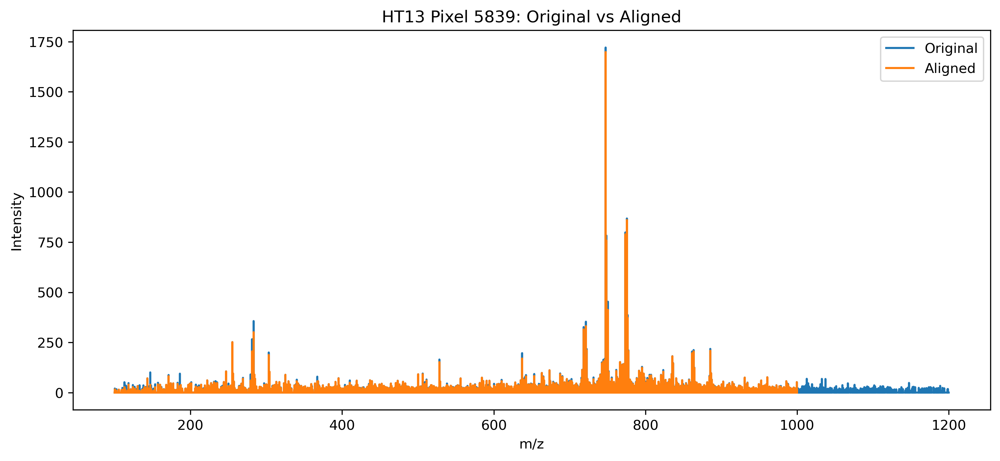
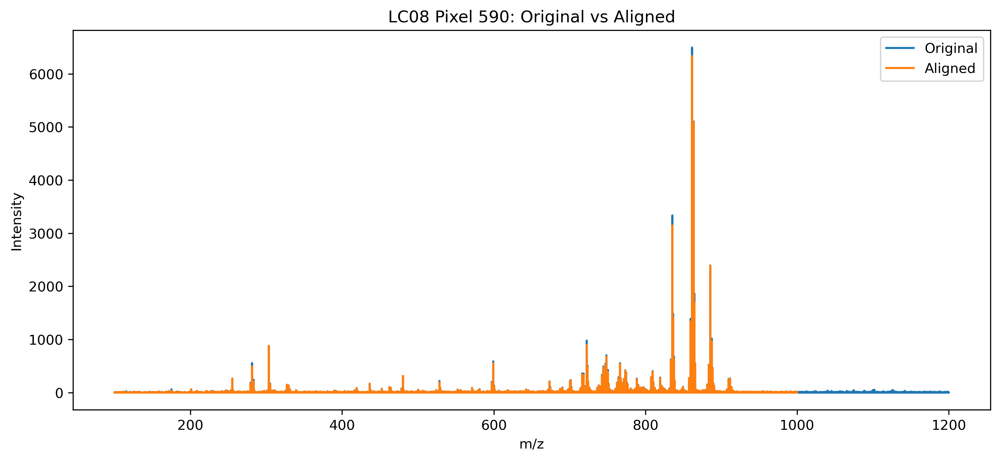
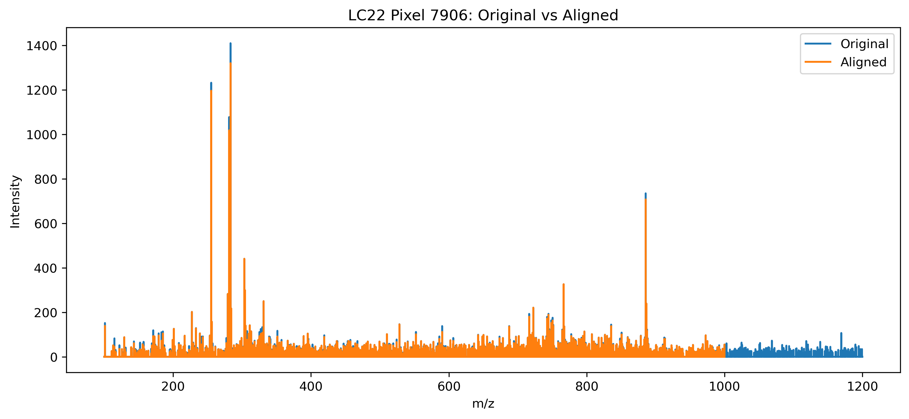
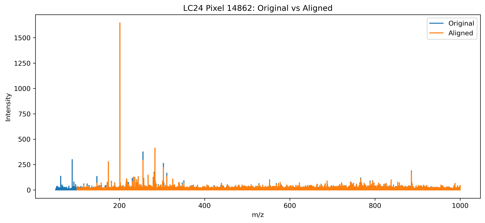

# DESI-MSI-Exploration  
#### DESI Mass Spectrometry Imaging (DESI-MSI) Processing Pipeline
#### Overview
This project develops a data processing pipeline for DESI data, focusing on lung cancer vs healthy tissue samples. 

#### Dataset
We work with imzML files from multiple tissue samples:
- Cancer samples
  * LC24
  * LC08
  * LC22
- Healthy samples
  * HT10
  * HT06
  * HT13
Each file contains:
- Pixel coordinates
- Mass spectra (m/z vs intensity)

The `ImzMLParser` function from the `pyimzML` package was used to read and process the data.
```python
from pyimzml.ImzMLParser import ImzMLParser
parser = ImzMLParser(path)
```

  Each parser provides:
- `coordinates` — spatial pixel layout
- `getspectrum(i)` — mass spectrum at pixel `i`
```


LC24
 pixels: 29346
 mz bins: 170955
------------------------------
LC08
 pixels: 9576
 mz bins: 135444
------------------------------
LC22
 pixels: 17271
 mz bins: 135194
------------------------------
HT10
 pixels: 15251
 mz bins: 134855
------------------------------
HT06
 pixels: 8181
 mz bins: 165661
------------------------------
HT13
 pixels: 8181
 mz bins: 135372
------------------------------
```
Since the samples contain different numbers of m/z bins and pixels, direct comparison and alignment become challenging. To address this, a common m/z grid was created using the overlapping m/z range shared across all samples. A median peak spacing of 0.005 was selected for interpolation:

```
LC24 median spacing: 0.004015173434979147
LC08 median spacing: 0.006097772624627851
LC22 median spacing: 0.006335430099909445
HT10 median spacing: 0.0062578307101262
HT06 median spacing: 0.005196135146434244
HT13 median spacing: 0.006339186375612371
```

```python
def get_common_mz(parsers, step=0.005):

    min_mz = []
    max_mz = []

    for parser in parsers:
        mz,_ = parser.getspectrum(0)
        min_mz.append(mz.min())
        max_mz.append(mz.max())

    global_min = max(min_mz)
    global_max = min(max_mz)

    common_mz = np.arange(global_min, global_max, step)

    print("Common mz range:", global_min, "-", global_max)
    print("Common bins:", len(common_mz))

    return common_mz

```
This returns a common m/z axis shared across all samples. The common m/z axis is then used to interpolate intensity values for each spectrum onto the shared grid. The function below returns the aligned data:

```python
def align_imzml_to_common_grid(parser, common_mz):

    n_pixels = len(parser.coordinates)
    n_bins = len(common_mz)

    aligned = np.zeros((n_pixels, n_bins), dtype=np.float32)

    for i in range(n_pixels):

        mzs, intensities = parser.getspectrum(i)

        # interpolate onto common mz axis
        aligned[i, :] = np.interp(
            common_mz,
            mzs,
            intensities,
            left=0,
            right=0
        )

        if i % 1000 == 0:
            print(f"Aligned {i}/{n_pixels}")

    return aligned
````
The aligned data contains approximately 180,000 m/z bins before feature reduction. All processed data is stored in a single HDF5 file for efficient storage and retrieval:
```
aligned_lung_roi_data.h5
```
The preprocessing scripts used for this step can be found [here](https://github.com/NalamotseJChoma/DESI-MSI-Exploration/tree/main/Data%20Preprocessing%20codes/imzML%20to%20hdf5%20codes): 


## HT06 Pixel 403 — Original vs Aligned Spectrum

Click the image below to open the interactive Plotly figure.

[](https://nalamotsejchoma.github.io/DESI-MSI-Exploration/Plots/Aligned_vs_original_plots/HT06_pixel_403.html)

[](https://nalamotsejchoma.github.io/DESI-MSI-Exploration/Plots/Aligned_vs_original_plots/HT10_pixel_13447.html)

[](https://nalamotsejchoma.github.io/DESI-MSI-Exploration/Plots/Aligned_vs_original_plots/HT13_pixel_5839.html)


[](https://nalamotsejchoma.github.io/DESI-MSI-Exploration/Plots/Aligned_vs_original_plots/LC08_pixel_590.html)

[](https://nalamotsejchoma.github.io/DESI-MSI-Exploration/Plots/Aligned_vs_original_plots/LC22_pixel_7906.html)

[](https://nalamotsejchoma.github.io/DESI-MSI-Exploration/Plots/Aligned_vs_original_plots/LC24_pixel_14862.html)


#### Binned Data
To reduce dimensionality and computational cost, the aligned spectra were further binned. Based on the relationship between feature count and bin width shown below, a bin size of 0.005 was selected, reducing the feature space to approximately 18,000 bins.

[](https://github.com/NalamotseJChoma/DESI-MSI-Exploration/blob/main/Plots/feature_count_vs_bin_width.html)

###### Binned vs Original plots
###### Correlation 
