# DESI-MSI-Exploration  
#### DESI Mass Spectrometry Imaging (DESI-MSI) Processing Pipeline
#### Overview
This project develops a data processing pipeline for DESI data, focusing on lung cancer vs healthy tissue samples. 

#### Dataset
We work with imzML files from multiple tissue samples:
- Cancer samples
  * LC24
  * LC08
  * LC22
- Healthy samples
  * HT10
  * HT06
  * HT13
Each file contains:
- Pixel coordinates
- Mass spectra (m/z vs intensity)

The `ImzMLParser` function from the `pyimzML` package was used to read and process the data.
```python
from pyimzml.ImzMLParser import ImzMLParser
parser = ImzMLParser(path)
```

  Each parser provides:
- `coordinates` — spatial pixel layout
- `getspectrum(i)` — mass spectrum at pixel `i`
```


LC24
 pixels: 29346
 mz bins: 170955
------------------------------
LC08
 pixels: 9576
 mz bins: 135444
------------------------------
LC22
 pixels: 17271
 mz bins: 135194
------------------------------
HT10
 pixels: 15251
 mz bins: 134855
------------------------------
HT06
 pixels: 8181
 mz bins: 165661
------------------------------
HT13
 pixels: 8181
 mz bins: 135372
------------------------------
```
Since the samples contain different numbers of m/z bins and pixels, direct comparison and alignment become challenging. To address this, a common m/z grid was created using the overlapping m/z range shared across all samples. A median peak spacing of 0.005 was selected for interpolation:

```
LC24 median spacing: 0.004015173434979147
LC08 median spacing: 0.006097772624627851
LC22 median spacing: 0.006335430099909445
HT10 median spacing: 0.0062578307101262
HT06 median spacing: 0.005196135146434244
HT13 median spacing: 0.006339186375612371
```

```python
def get_common_mz(parsers, step=0.005):

    min_mz = []
    max_mz = []

    for parser in parsers:
        mz,_ = parser.getspectrum(0)
        min_mz.append(mz.min())
        max_mz.append(mz.max())

    global_min = max(min_mz)
    global_max = min(max_mz)

    common_mz = np.arange(global_min, global_max, step)

    print("Common mz range:", global_min, "-", global_max)
    print("Common bins:", len(common_mz))

    return common_mz

```
This returns a common m/z axis shared across all samples. The common m/z axis is then used to interpolate intensity values for each spectrum onto the shared grid. The function below returns the aligned data:

```python
def align_imzml_to_common_grid(parser, common_mz):

    n_pixels = len(parser.coordinates)
    n_bins = len(common_mz)

    aligned = np.zeros((n_pixels, n_bins), dtype=np.float32)

    for i in range(n_pixels):

        mzs, intensities = parser.getspectrum(i)

        # interpolate onto common mz axis
        aligned[i, :] = np.interp(
            common_mz,
            mzs,
            intensities,
            left=0,
            right=0
        )

        if i % 1000 == 0:
            print(f"Aligned {i}/{n_pixels}")

    return aligned
````
The aligned data contains approximately 180,000 m/z bins before feature reduction. All processed data is stored in a single HDF5 file for efficient storage and retrieval:
```
aligned_lung_roi_data.h5
```
The preprocessing scripts used for this step can be found [here](https://github.com/NalamotseJChoma/DESI-MSI-Exploration/tree/main/Data%20Preprocessing%20codes/imzML%20to%20hdf5%20codes): 


## HT06 Pixel 403 — Original vs Aligned Spectrum

Click the image below to open the interactive Plotly figure.

[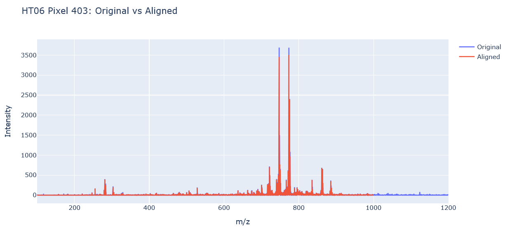](https://nalamotsejchoma.github.io/DESI-MSI-Exploration/Plots/Aligned_vs_original_plots/HT06_pixel_403.html)

[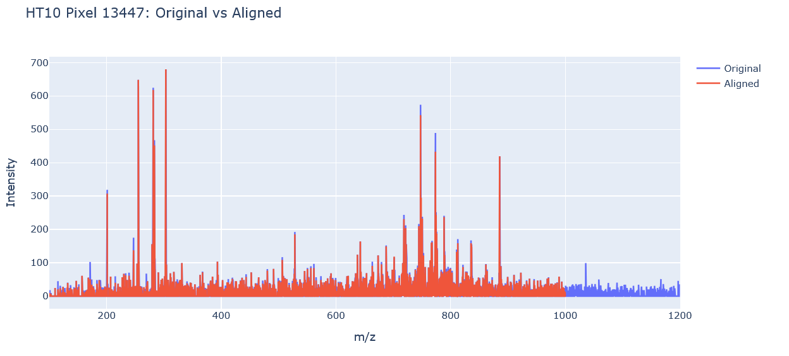](https://nalamotsejchoma.github.io/DESI-MSI-Exploration/Plots/Aligned_vs_original_plots/HT10_pixel_13447.html)

[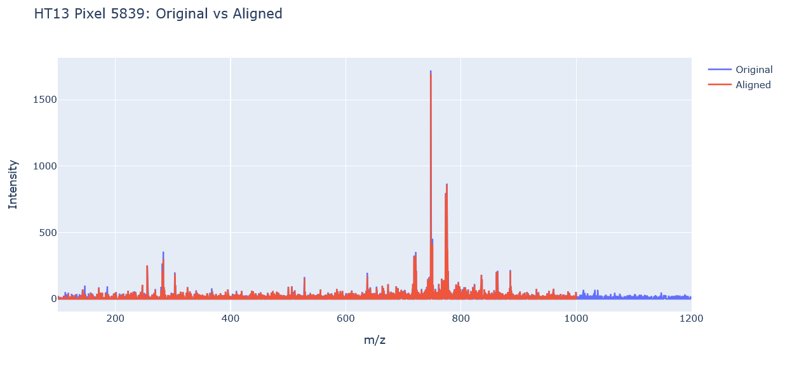](https://nalamotsejchoma.github.io/DESI-MSI-Exploration/Plots/Aligned_vs_original_plots/HT13_pixel_5839.html)


[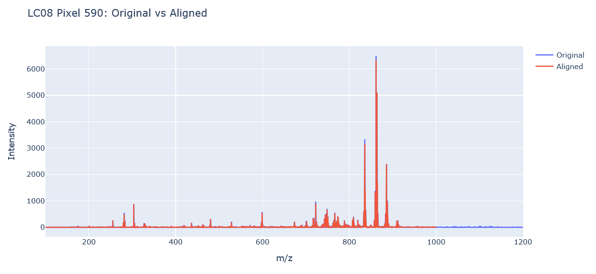](https://nalamotsejchoma.github.io/DESI-MSI-Exploration/Plots/Aligned_vs_original_plots/LC08_pixel_590.html)

[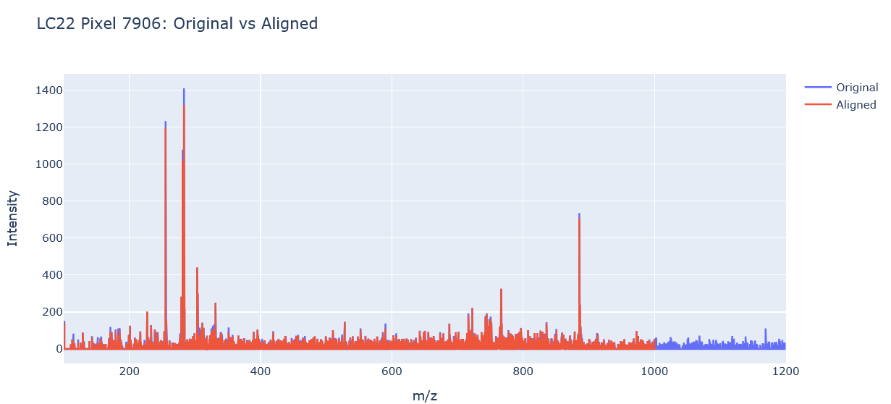](https://nalamotsejchoma.github.io/DESI-MSI-Exploration/Plots/Aligned_vs_original_plots/LC22_pixel_7906.html)

[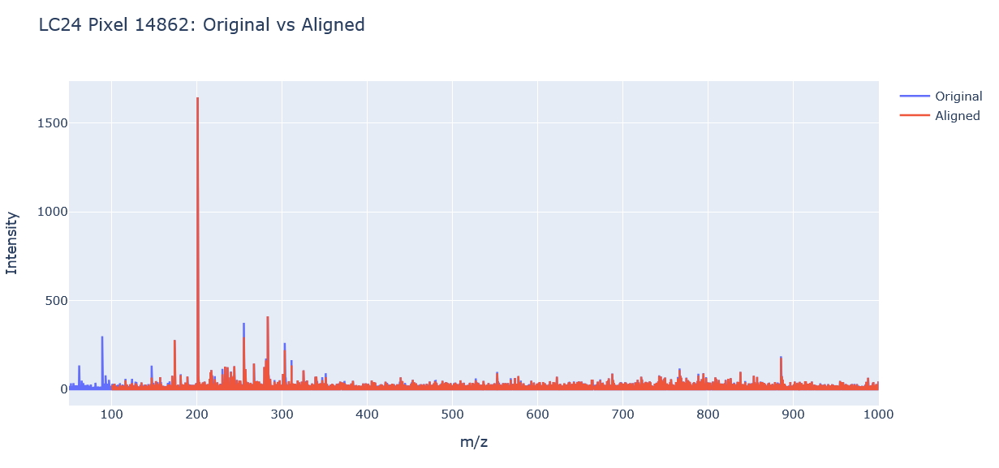](https://nalamotsejchoma.github.io/DESI-MSI-Exploration/Plots/Aligned_vs_original_plots/LC24_pixel_14862.html)

[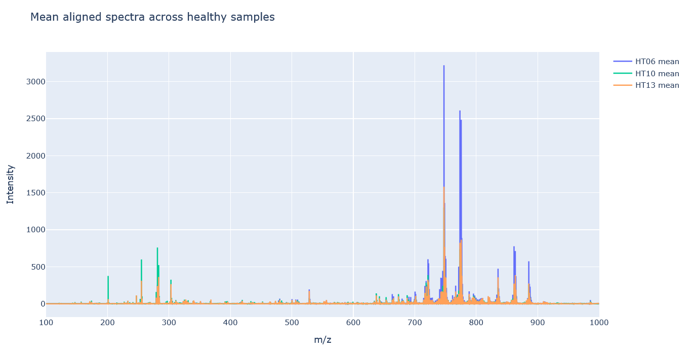](https://nalamotsejchoma.github.io/DESI-MSI-Exploration/Plots/mean_aligned_spectra_healthy.html)

[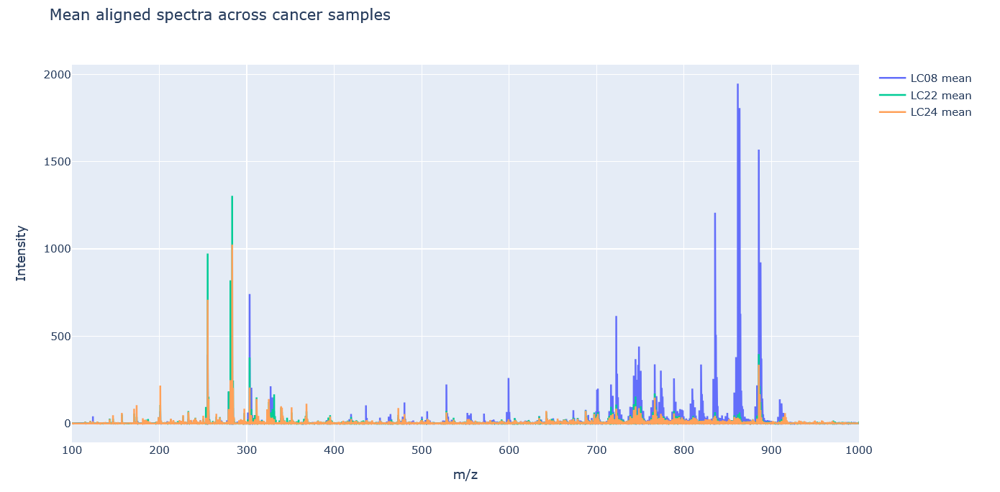](https://nalamotsejchoma.github.io/DESI-MSI-Exploration/Plots/mean_aligned_spectra_cancer.html)

## PCA

[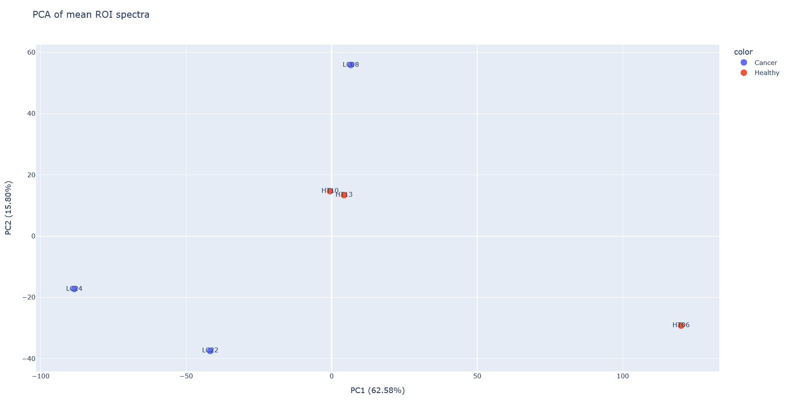](https://nalamotsejchoma.github.io/DESI-MSI-Exploration/Plots/PCA_full_data.html)

[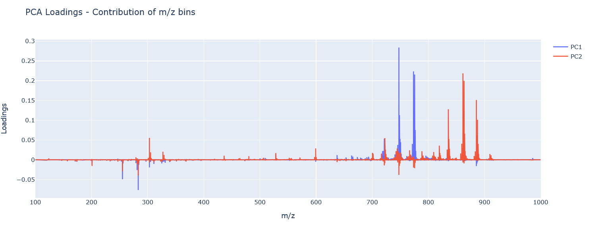](https://nalamotsejchoma.github.io/DESI-MSI-Exploration/Plots/PCA_loadings.html)


[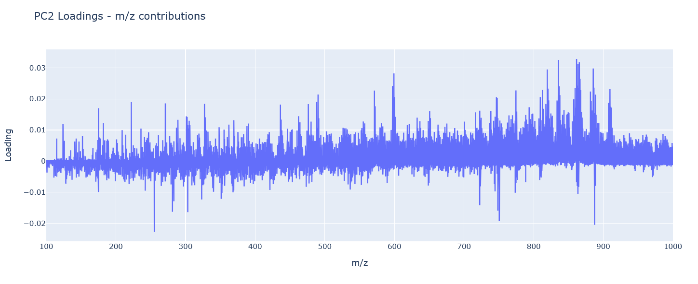](https://nalamotsejchoma.github.io/DESI-MSI-Exploration/Plots/PC2_loadings.html)

```
Top 20 m/z bins contributing to PC1: [747.52255154 747.51755154 747.52755154 773.52755154 775.54755154
 773.53255154 775.55255154 747.53255154 773.54755154 773.53755154
 773.54255154 775.55755154 773.52255154 773.55255154 747.51255154
 775.54255154 775.56255154 747.53755154 774.53755154 774.54255154]

Top 20 m/z bins contributing to PC2: [861.55255154 861.55755154 863.56755154 863.57255154 861.56255154
 861.54755154 863.57755154 861.56755154 885.55255154 863.56255154
 863.58255154 885.54755154 885.55755154 861.57255154 835.53755154
 835.53255154 863.58755154 885.54255154 885.56255154 885.53755154]
```


#### Binned Data
To reduce dimensionality and computational cost, the aligned spectra were further binned. Based on the relationship between feature count and bin width shown below, a bin size of 0.005 was selected, reducing the feature space to approximately 18,000 bins.

[](https://nalamotsejchoma.github.io/DESI-MSI-Exploration/Plots/feature_count_vs_bin_width.html)

```


LC24
 pixels: 29346
 mz bins: 17999
------------------------------
LC08
 pixels: 9576
 mz bins: 17999
------------------------------
LC22
 pixels: 17271
 mz bins: 17999
------------------------------
HT10
 pixels: 15251
 mz bins: 17999
------------------------------
HT06
 pixels: 8181
 mz bins: 17999
------------------------------
HT13
 pixels: 8181
 mz bins: 17999
------------------------------
```
[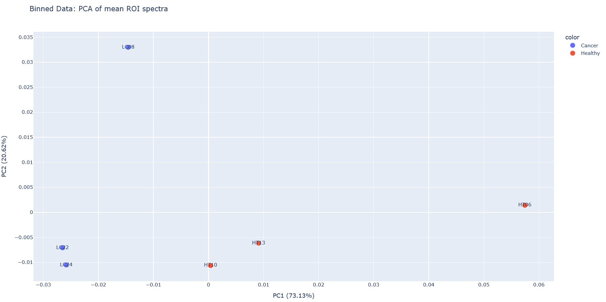](https://nalamotsejchoma.github.io/DESI-MSI-Exploration/Plots/Aligned_vs_original_plots/binned_PCA_full_data.html)

[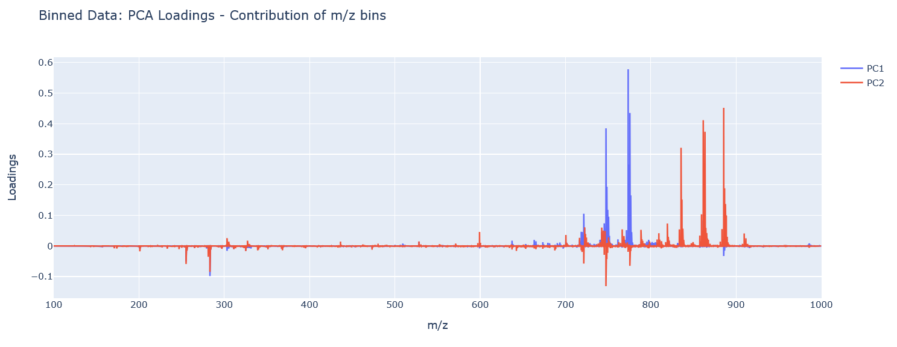](https://nalamotsejchoma.github.io/DESI-MSI-Exploration/Plots/Aligned_vs_original_plots/binned_PCA_loadings.html)

```
Top 20 m/z bins contributing to PC1: [773.54255154 775.54255154 747.54255154 774.54255154 747.49255154
 748.54255154 776.54255154 749.54255154 721.49255154 748.49255154
 283.24255154 750.54255154 861.54255154 863.54255154 745.49255154
 773.49255154 722.49255154 775.59255154 863.59255154 771.54255154]
Top 20 m/z bins contributing to PC2: [885.54255154 861.54255154 863.59255154 835.54255154 886.54255154
 885.59255154 863.54255154 861.59255154 836.54255154 887.54255154
 747.49255154 862.54255154 859.54255154 835.49255154 888.59255154
 747.54255154 887.59255154 283.24255154 886.59255154 819.49255154]
```

###### Binned vs Original plots
###### Correlation 
For this section we selected top 50 variable ions for each sample and computed some correlation for each. (find the biology in this and the reason or motivation for carrying out this part). Why look at the top 50 individual samples separately. Look at the degree of variability. Healthy tissue has less variability. The top 50 in the cancer tissue varries from the that in healthy tissue. Degree of variability......

Select top 50 from the cancer cells to and see if there is an overlap. Is it the same 50? Get a Venn diagram or ion map of this. This tells how similar are the cancer tissues..... Compare intesity in the cancer and healthy tissue, for individual ions across samples. Put the correlation plots in the same place for easy comparison. If the top 50 are different in the cancer cells, it means there is no homogeneity among the cancer samples, in what's varrying the most. Plot the distribution for the ion for lung and healthy, using one color for each and do some statistical test to see if there is a difference in the distribtution in the cancer and the control. 
##### Cancer Tissue correlation and ion maps
<table>
  <tr>
    <td align="center">
      <a href="https://github.com/NalamotseJChoma/DESI-MSI-Exploration/blob/main/Plots/Correlation_and_ion_maps/ion_spatial_colocalization_cancer_LC08.png">
        
      </a>
      <br>
      LC08
    </td>

  <td align="center">
      <a href="https://github.com/NalamotseJChoma/DESI-MSI-Exploration/blob/main/Plots/Correlation_and_ion_maps/ion_spatial_colocalization_cancer_LC22.png">
        
      </a>
      <br>
      LC22
    </td>

  <td align="center">
      <a href="https://github.com/NalamotseJChoma/DESI-MSI-Exploration/blob/main/Plots/Correlation_and_ion_maps/ion_spatial_colocalization_cancer_LC24.png">
        
      </a>
      <br>
      LC24
    </td>
  </tr>
</table>

[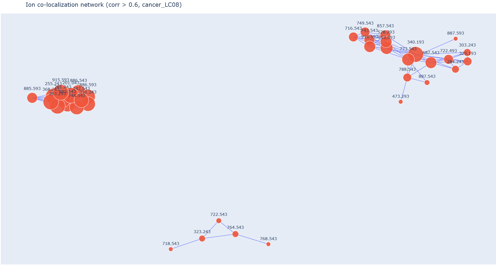](https://nalamotsejchoma.github.io/DESI-MSI-Exploration/Plots/Correlation_and_ion_maps/ion_network_cancer_LC08.html)

[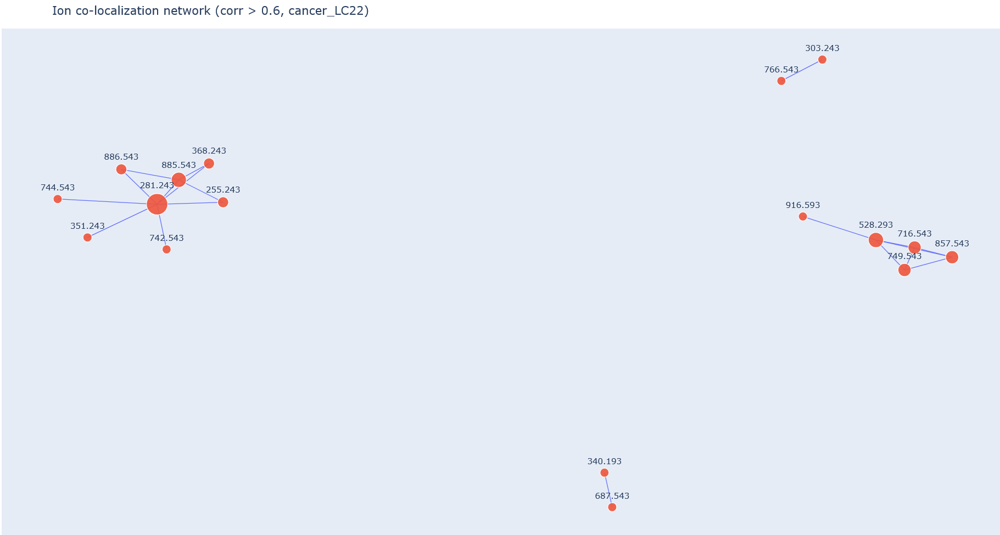](https://nalamotsejchoma.github.io/DESI-MSI-Exploration/Plots/Correlation_and_ion_maps/ion_network_cancer_LC22.html)

[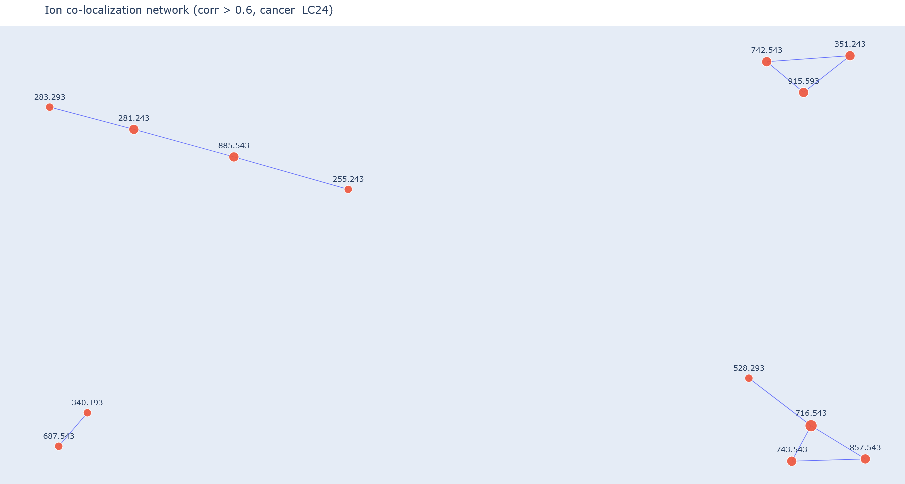](https://nalamotsejchoma.github.io/DESI-MSI-Exploration/Plots/Correlation_and_ion_maps/ion_network_cancer_LC24.html)


#### Healthy tissue correlations and ions maps

<table>
  <tr>
    <td align="center">
      <a href="https://github.com/NalamotseJChoma/DESI-MSI-Exploration/blob/main/Plots/Correlation_and_ion_maps/ion_spatial_colocalization_healthy_HT06.png">
        
      </a>
      <br>
      HT06
    </td>

  <td align="center">
      <a href="https://github.com/NalamotseJChoma/DESI-MSI-Exploration/blob/main/Plots/Correlation_and_ion_maps/ion_spatial_colocalization_healthy_HT10.png">
        
      </a>
      <br>
      HT10
    </td>

  <td align="center">
      <a href="https://github.com/NalamotseJChoma/DESI-MSI-Exploration/blob/main/Plots/Correlation_and_ion_maps/ion_spatial_colocalization_healthy_HT13.png">
        
      </a>
      <br>
      HT13
    </td>
  </tr>
</table>

[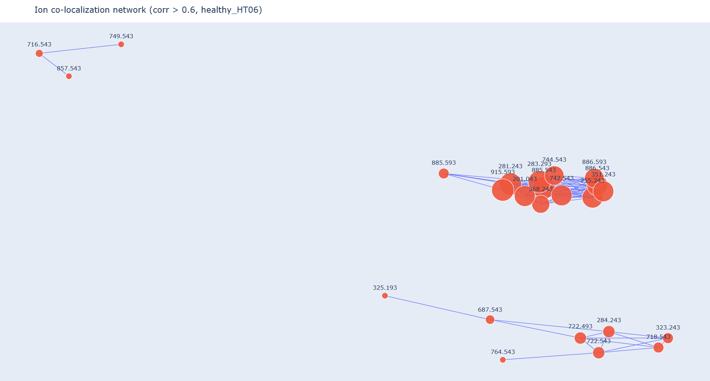](https://nalamotsejchoma.github.io/DESI-MSI-Exploration/Plots/Correlation_and_ion_maps/ion_network_healthy_HT06.html)

[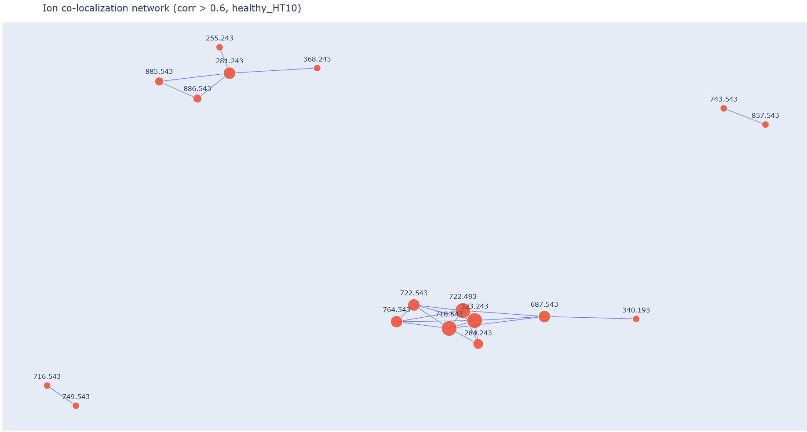](https://nalamotsejchoma.github.io/DESI-MSI-Exploration/Plots/Correlation_and_ion_maps/ion_network_healthy_HT10.html)

[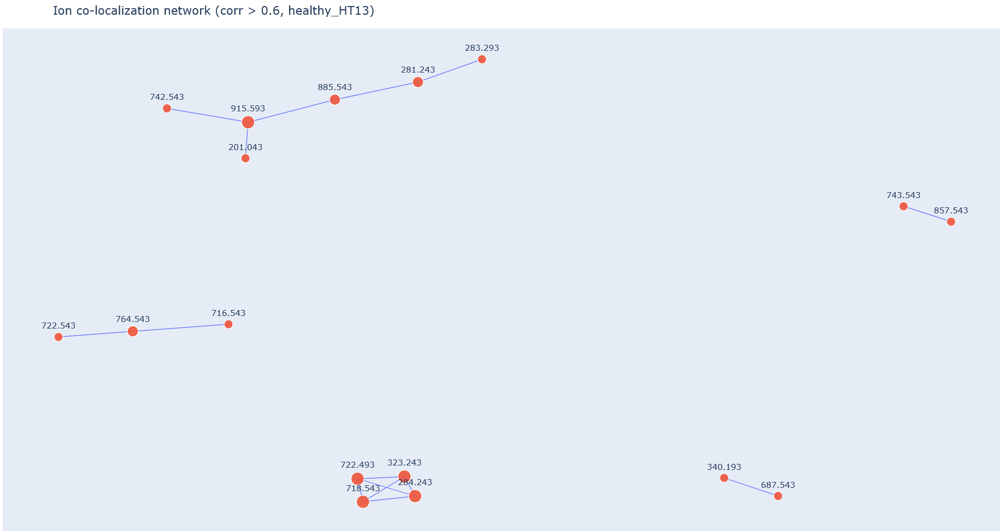](https://nalamotsejchoma.github.io/DESI-MSI-Exploration/Plots/Correlation_and_ion_maps/ion_network_healthy_HT13.html)


Compare the similarity in correlation matrix using some ML. 
